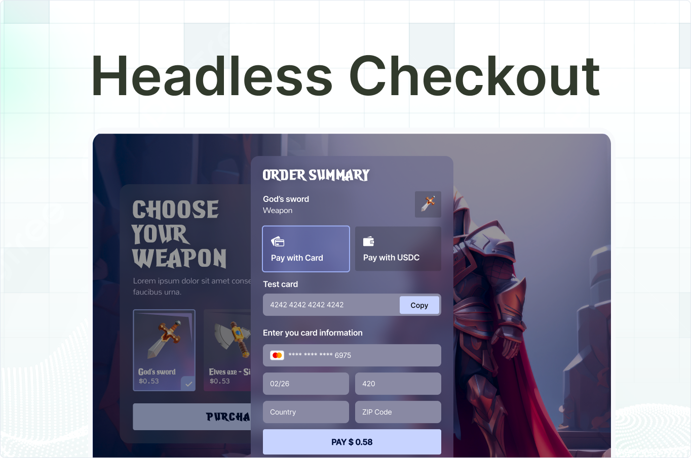

<div align="center">

<br>
<br>
<h1>Headless Checkout Quickstart</h1>

<div align="center">
<a href="https://headless-checkout.demos-crossmint.com/">Live Demo</a> | <a href="https://docs.crossmint.com/payments/embedded/overview">Docs</a> | <a href="https://github.com/crossmint">See all quickstarts</a>
</div>

<br>
<br>

</div>

## Introduction

Allow your customers to buy NFTs with credit card and crypto payments, using Crossmint's headless checkout. This quickstart provides a seamless integration for accepting payments in your dApp using the Crossmint Orders API.

**Key features:**

- Accept fiat payments via credit, debit card, Apple Pay and Google Pay
- Accept crypto payments (USDC, USDT, ETH, SOL, and more)
- Deliver NFTs directly to a buyer's wallet or email address
- Full order management with real-time status updates
- Switch between payment methods dynamically

## How It Works

This implementation uses Crossmint's **Headless Orders API** to create a completely custom checkout experience. The flow works as follows:

### Order Management API

The quickstart demonstrates the complete order lifecycle using three core API endpoints:

1. **[Create Order](https://docs.crossmint.com/api-reference/headless/create-order)** - Creates a new order with initial payment method and recipient details
2. **[Get Order](https://docs.crossmint.com/api-reference/headless/get-order)** - Retrieves order status and polls for completion
3. **[Update Order](https://docs.crossmint.com/api-reference/headless/edit-order)** - Updates order details like recipient email/wallet or payment method

**See API implementation**: [`lib/api.ts`](lib/api.ts)

### Payment Flows

#### Card Payments

- **[Pay with Card Guide](https://docs.crossmint.com/payments/headless/quickstarts/credit-card-nft)**
- Uses **Stripe Elements** with customizable UI styling
- **No Stripe account required** for your users - we provide the Stripe keys
- Crossmint returns `stripePublishableKey` and `stripeClientSecret` for seamless payment processing
- Supports credit cards, debit cards, Apple Pay, and Google Pay
- **See implementation**: [`components/card-payment.tsx`](components/card-payment.tsx)

#### Crypto Payments  

- **[Pay with USDC Guide](https://docs.crossmint.com/payments/headless/quickstarts/paying-usdc)**
- **[Pay with Any Crypto Guide](https://docs.crossmint.com/payments/headless/quickstarts/crypto)**
- Supports **crosschain crypto payments** on any blockchain and token (Solana, USDC, USDT, ETH, MATIC, etc.)
- Crossmint returns a `serializedTransaction` that gets parsed and signed by the user's wallet
- **Transaction signing**: Users sign the prepared transaction using their connected wallet (MetaMask, Phantom, etc.)
- No complex transaction building required - just parse and sign the provided transaction
- Get test tokens: [USDC Faucet](https://faucet.circle.com/) | [ETH Faucet](https://faucet.quicknode.com/base/sepolia)
- **See implementation**: [`components/crypto-payment.tsx`](components/crypto-payment.tsx)

### Order Lifecycle & Status Polling

Orders progress through different phases, each with specific statuses that you can poll to update your UI:

- **Quote Phase**: Order is created and pricing is being calculated (`requires-quote`)
- **Payment Phase**: Order is ready for payment (`awaiting-payment`, `completed`)  
- **Delivery Phase**: NFT is being minted and delivered after successful payment
- **Completed Phase**: Order is fully processed and NFT delivered

The quickstart demonstrates **status polling** using the Get Order API to:

- Check payment completion in real-time
- Update the UI based on order status changes
- Handle different payment states (success, failure, insufficient funds)

### Client-Side vs Server-Side

This quickstart uses a **client-side approach** with:

- Client-side API key with **`orders.read` scope** (`NEXT_PUBLIC_CROSSMINT_API_KEY`)
- `clientSecret` returned from Create Order API - this JWT token authenticates subsequent Update Order and Get Order calls
- No additional API scopes needed for update/get operations when using `clientSecret`
- For **server-side implementations**, use a server-side API key with `orders.create`, `orders.update`, and `orders.read` scopes

### Prerequisites

- Create a developer account in the [Staging Console](https://staging.crossmint.com/signin?callbackUrl=/console).
- Create a [new collection](https://docs.crossmint.com/payments/guides/create-collection) or [import yours](https://docs.crossmint.com/payments/guides/register-collection) in the console, and have your `collectionId` ready.
- Make sure your collection has at least one NFT configured.
- From the detail view of your collection, navigate to the Checkout tab to configure the pricing settings and enable Credit Card and Crypto payments.

## Deploy

Easily deploy the template to Vercel with the button below. You will need to set the required environment variables in the Vercel dashboard.

[](https://vercel.com/new/clone?repository-url=https%3A%2F%2Fgithub.com%2FCrossmint%2Fheadless-checkout-quickstart&env=NEXT_PUBLIC_CROSSMINT_API_KEY&env=NEXT_PUBLIC_CROSSMINT_COLLECTION_ID)

## Setup

1. Clone the repository and navigate to the project folder:

    ```bash
    git clone https://github.com/crossmint/headless-checkout-quickstart.git && cd headless-checkout-quickstart
    ```

2. Install all dependencies:

    ```bash
    npm install
    # or
    yarn install
    # or
    pnpm install
    # or
    bun install
    ```

3. Set up the environment variables by copying the template file:

    ```bash
    cp .env.template .env
    ```

4. Add your Crossmint `collectionId` to the `.env` file.

    ```bash
    NEXT_PUBLIC_CROSSMINT_COLLECTION_ID=your_collection_id
    ```

5. Get your client-side API key from the [Crossmint Console Overview](https://staging.crossmint.com/console/overview) and add it to the `.env` file.

    ```bash
    NEXT_PUBLIC_CROSSMINT_API_KEY=your_api_key
    ```

6. Run the development server:

    ```bash
    npm run dev
    # or
    yarn dev
    # or
    pnpm dev
    # or
    bun dev
    ```

## Using in production

1. Headless checkout is available on Staging for testing purposes. If you would like to use this on Production, [contact sales](https://www.crossmint.com/contact/sales) to request access.
2. Create an account in the [Production Console](https://www.crossmint.com/signin?callbackUrl=/console), add your collection and configure the payment settings from the Checkout tab.
3. Verify your account as the project owner and verify your collection. [Learn more](https://docs.crossmint.com/introduction/platform/account-verification) about verifications.
4. Update your `.env` file with your production variables.
5. Deploy your application to a production environment.

## Advanced Usage

For advanced usage, refer to the Crossmint documentation:

- Add Apple Pay: [https://docs.crossmint.com/payments/embedded/guides/apple-pay](https://docs.crossmint.com/payments/embedded/guides/apple-pay)
- Customize the UI: [https://docs.crossmint.com/payments/embedded/guides/ui-customization](https://docs.crossmint.com/payments/embedded/guides/ui-customization)
- Edit payment methods: [https://docs.crossmint.com/payments/embedded/guides/payment-methods](https://docs.crossmint.com/payments/embedded/guides/payment-methods)